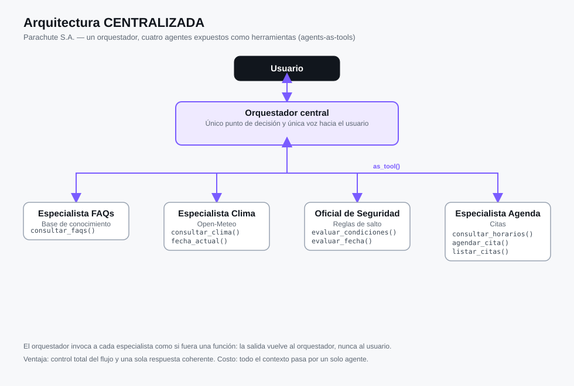
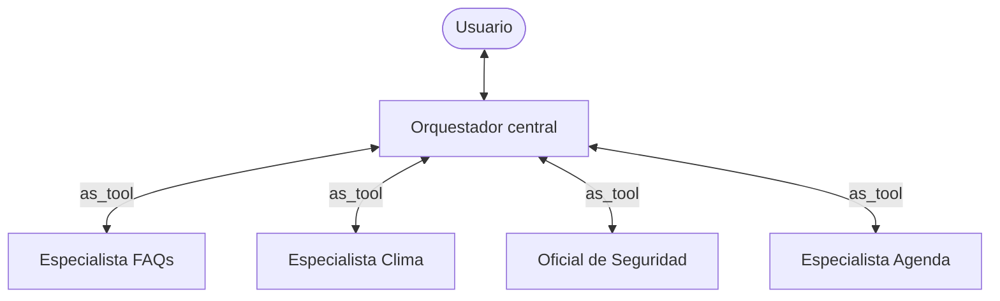
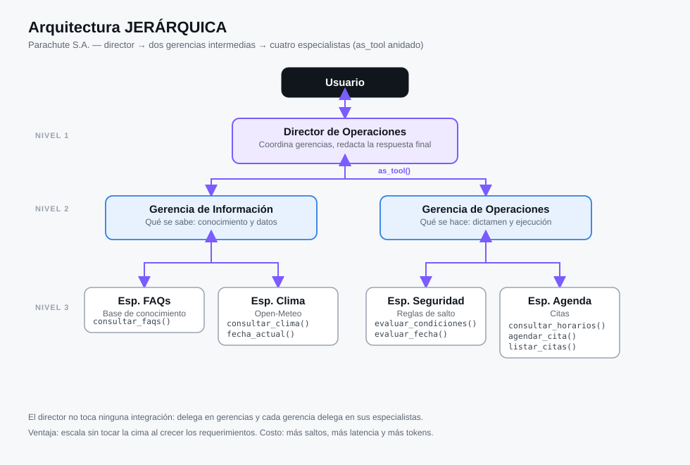
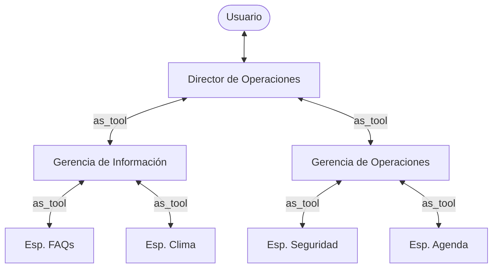
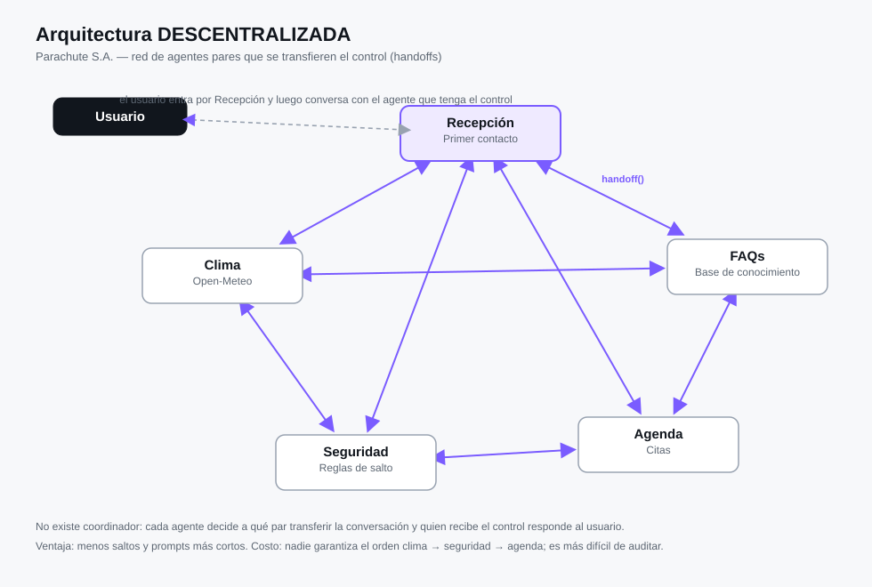
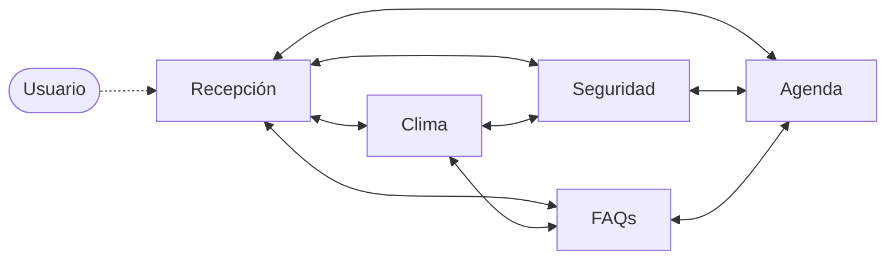

# Hoja de trabajo #5 — Orquestación de sistemas multiagente (CC3116)

Agente de **Parachute S.A.** implementado con tres arquitecturas de orquestación distintas
—centralizada, jerárquica y descentralizada— resolviendo el mismo problema: responder FAQs,
consultar el clima en la zona de aterrizaje, dictaminar si el día es apto para saltar y
calendarizar la cita.

| Programa | Arquitectura | Mecanismo del SDK |
|---|---|---|
| `centralizada.py` | Un orquestador, cuatro especialistas | `Agent.as_tool()` |
| `jerarquica.py` | Director → 2 gerencias → 4 especialistas | `as_tool()` anidado |
| `descentralizada.py` | Red de 5 agentes pares | `handoffs` |

Diagramas en [`diagramas/`](diagramas) · Respuestas a las preguntas en
[`docs/respuestas.pdf`](docs/respuestas.pdf).

---

## Instalación

```bash
python -m venv .venv
source .venv/bin/activate        # Windows: .venv\Scripts\activate
pip install -r requirements.txt

cp .env.example .env             # y coloca tu llave
```

`.env`:


Funciona con cualquier proveedor compatible con la API de OpenAI (Groq, NVIDIA Build, OpenAI,
Ollama). Solo se cambian esas tres variables: ningún archivo de código se toca.

## Ejecución

```bash
python centralizada.py
python jerarquica.py
python descentralizada.py
```

Ejemplos de conversación:

```
Usuario > ¿Cuánto cuesta un salto tándem y qué necesito llevar?
Usuario > Quiero agendar para el 2026-09-25 a las 08:30, soy Ana López, 5555-5555
Usuario > ¿Y si mejor lo hago dentro de dos meses?      -> corrige: máximo 16 días
```

## Estructura

```
.
├── centralizada.py          # arquitectura 1
├── jerarquica.py            # arquitectura 2
├── descentralizada.py       # arquitectura 3
├── core/                    # compartido por las tres (aquí vive toda la lógica)
│   ├── config.py            # proveedor de LLM y constantes del negocio
│   ├── domain.py            # ClimaDia, Veredicto, Cita, Criterio
│   ├── weather.py           # integración con Open-Meteo
│   ├── safety.py            # motor determinístico de reglas de salto
│   ├── scheduling.py        # repositorio de citas
│   ├── knowledge.py         # base de FAQs
│   ├── tools.py             # catálogo único de function_tool
│   ├── prompts.py           # instrucciones de cada agente
│   ├── agents_base.py       # fábrica de los 4 especialistas
│   └── runner.py            # bucle de consola compartido
├── data/faqs.md             # base de conocimiento
├── diagramas/               # SVG de las tres arquitecturas
└── docs/respuestas.pdf      # respuestas a las preguntas
```

## La abstracción

Las tres arquitecturas **no reimplementan nada**: importan los mismos `function_tool` de
`core/tools.py` y los mismos especialistas de `core/agents_base.py`. Lo único que cambia entre
los tres archivos es el cableado de los agentes.

Agregar el siguiente requerimiento que pida Parachute S.A. son cuatro pasos:

1. módulo de integración en `core/`,
2. envolverlo en un `@function_tool` en `core/tools.py`,
3. agregar el especialista en `core/agents_base.py`,
4. conectarlo en cada arquitectura (una línea por archivo).

### Reglas de seguridad

Viven en `core/safety.py` como código, no en el prompt. El LLM nunca decide si se puede saltar:
solo invoca la herramienta y comunica el veredicto.

| Variable | IDEAL | MARGINAL | PROHIBIDO |
|---|---|---|---|
| Viento superficie `wind_speed_10m` | < 20 km/h | 20 – 28 km/h | > 28 km/h |
| Ráfagas `wind_gusts_10m` | ≤ 35 km/h | — | > 35 km/h |
| Precipitación `precipitation` | 0.0 mm | — | > 0.0 mm |
| Nubosidad `cloud_cover` | < 30 % | 30 – 75 % | > 75 % |

El veredicto global es el criterio más restrictivo. Con `PROHIBIDO`, `agendar_cita()` rechaza
el registro aunque el modelo insista.

### Open-Meteo

- Coordenadas fijas de la zona de aterrizaje: `14.013722, -90.771611`.
- Si la fecha es hoy se usa `current`; para el resto de la ventana se usa `daily`
  (`temperature_2m_max`, `precipitation_sum`, `cloud_cover_mean`, `wind_speed_10m_max`,
  `wind_gusts_10m_max`).
- Fechas a más de **16 días** se rechazan antes de llamar a la API, indicando la fecha máxima
  posible.

## Arquitecturas

### Centralizada





Un solo agente decide, invoca y redacta. Los especialistas nunca hablan con el usuario.

### Jerárquica





Tres niveles. El director solo conoce dos herramientas; cada gerencia coordina a sus
especialistas y agrega el resultado hacia arriba.

### Descentralizada





Sin coordinador. El control se transfiere con `handoff` y permanece en el último agente que
atendió, por eso el runner se ejecuta con `conservar_agente=True`.

